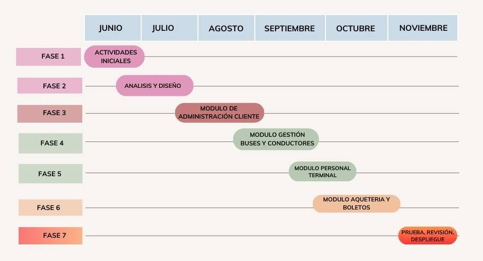
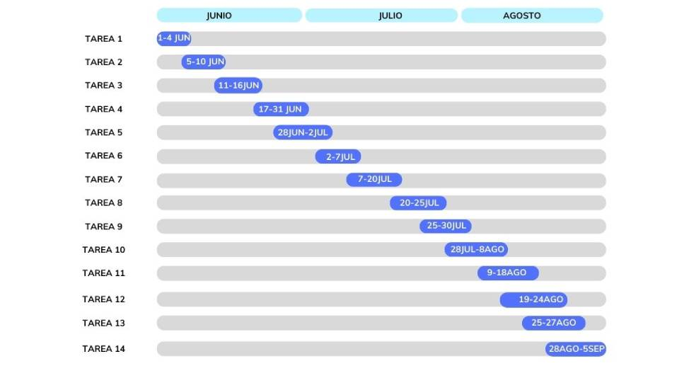
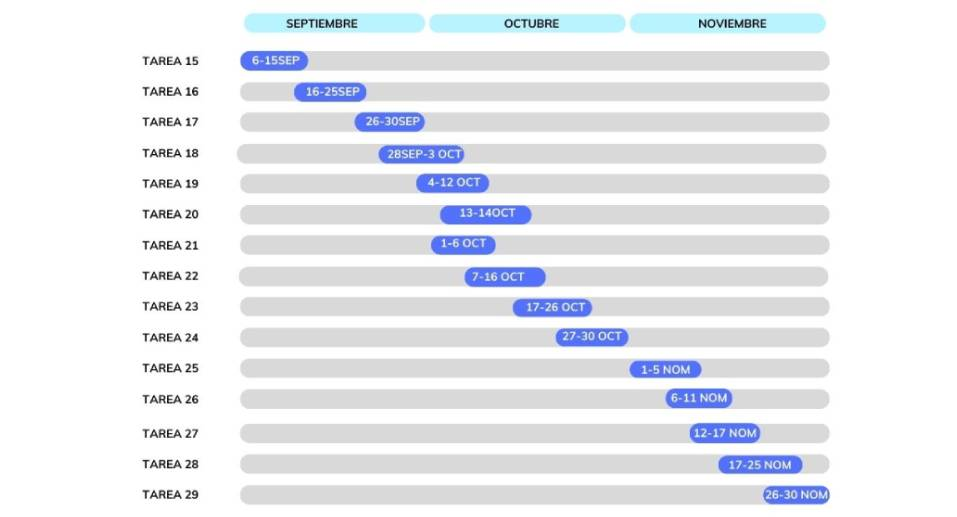

# MODULO I

### 📜 INTRODUCCIÓN

La gestión de una terminal de autobuses es una tarea desafiante que requiere una administración de procesos efectiva y automatizada para brindar a los clientes un servicio de alta calidad. El objetivo de este proyecto es desarrollar un software que gestione la terminal de autobuses, mejorando la calidad del servicio que se ofrece a los clientes. Con el software, se busca automatizar y optimizar los procesos de la terminal de autobuses, permitiendo una administración eficiente de la información relacionada con los clientes, buses, empresas de autobuses y el personal de administración. Asimismo, se espera que el software sea fácil de usar, confiable y que se adapte a las necesidades específicas de la terminal de autobuses.

### 📚 ANTECEDENTES

Para las empresas que brindan este servicio, la gestión de terminales de buses ha sido un desafío persistente porque requiere una coordinación y organización efectiva para cumplir con las expectativas de los clientes y garantizar la viabilidad financiera. La gestión de las terminales de buses se ha beneficiado mucho en los últimos años del uso de las tecnologías de la información y la comunicación (TIC), lo que ha permitido automatizar y optimizar procesos al tiempo que eleva la calidad del servicio.

### 🎯 PLANTEAMIENTO DEL PROBLEMA

La gestión de una terminal de buses es un proceso complejo que implica la coordinación y el control de múltiples variables, como la gestión de los buses, el personal, los clientes y la relación con las empresas de buses, todo esto en torno a la información que se genera en una terminal. Este proceso puede volverse aún más complejo cuando se consideran todas las variables que implica administrar la terminal, lo que puede resultar en una mayor probabilidad de errores y demoras en los procesos.

### 🌳 ÁRBOL DE PROBLEMAS

#### Problema central: Desarrollo inadecuado del software de gestión de la terminal de buses X.

1.1. Falta de información y seguimiento adecuados del personal.
   - 1.1.1. Dificultad para gestionar la información de los empleados.

1.2. Ineficiencia en la gestión de los choferes de autobuses.
   - 1.2.1. Dificultad para asignar y programar los horarios de los choferes.
   - 1.2.2. Pérdida de ingresos debido a la falta de una programación eficiente de viajes y cancelación de viajes.

1.3. Problemas en la gestión de información de clientes y venta de boletos.
   - 1.3.1. Falta de una base de datos centralizada para almacenar y gestionar la información de los clientes.
   - 1.3.2. Fallos en el proceso de venta de boletos y emisión de tickets.
   - 1.3.3. Pérdida de ingresos debido a la ineficiencia en la gestión de clientes y la venta de boletos.

1.4. Exceso de costos durante el desarrollo del software debido a una mala planificación y gestión del proyecto.
   - 1.4.1. Falta de un presupuesto adecuado y seguimiento de los gastos del proyecto.
   - 1.4.2. Desviaciones en el alcance y los plazos del proyecto que

 generan gastos adicionales.
   - 1.4.3. Riesgo de falta de financiamiento para completar el desarrollo del software.

1.5. Problemas de seguridad de la información.
   - 1.5.1. Vulnerabilidades en la protección de datos personales y confidenciales.
   - 1.5.2. Sanciones y multas por incumplimiento de regulaciones de privacidad y seguridad.

1.6. Falta de escalabilidad y adaptabilidad del software.
   - 1.6.1. Dificultad para manejar el crecimiento y los cambios en la terminal de buses.
   - 1.6.2. Costos adicionales por actualizaciones y modificaciones constantes del software.

### ❓ FORMULACIÓN DEL PROBLEMA

#### Problema central: Desarrollo inadecuado del software de gestión de la terminal de buses X.

1.1. Falta de información y seguimiento adecuados del personal.
   - Formulación del problema: ¿Cómo mejorar la gestión de información y seguimiento del personal de la terminal de buses X para garantizar un desempeño eficiente y optimizar los recursos humanos?

1.2. Ineficiencia en la gestión de los choferes de autobuses.
   - Formulación del problema: ¿Cómo lograr una asignación y programación eficiente de horarios para los choferes de autobuses de manera que se optimice la operación y se eviten cancelaciones de viajes?

1.3. Problemas en la gestión de clientes y venta de boletos.
   - Formulación del problema: ¿Cómo implementar una base de datos centralizada y un proceso eficiente de venta de boletos que permita gestionar de manera adecuada la información de los clientes y optimizar los ingresos de la terminal de buses X?

1.4. Exceso de costos durante el desarrollo del software debido a una mala planificación y gestión del proyecto.
   - Formulación del problema: ¿Cómo asegurar una planificación y gestión adecuadas del proyecto de desarrollo del software de manera que se evite el exceso de costos y se cumplan los plazos y el alcance establecidos?

1.5. Problemas de seguridad de la información.
   - Formulación del problema: ¿Cómo garantizar la protección adecuada de los datos personales y confidenciales de los clientes, evitando vulnerabilidades y cumpliendo con las regulaciones de privacidad y seguridad?

1.6. Falta de escalabilidad y adaptabilidad del software.
   - Formulación del problema: ¿Cómo diseñar y desarrollar el software de gestión de la terminal de buses X de manera que sea escalable y adaptable a los cambios y crecimiento de la terminal, evitando costos adicionales por actualizaciones constantes?

### 🎓 PROPÓSITO DE ESTUDIO

#### OBJETIVO GENERAL

Desarrollar un software que gestione la terminal de autobuses, que permita cumplir con una administración eficiente y automatizada de los procesos, mejorando la calidad en el servicio con los clientes.

#### OBJETIVOS ESPECÍFICOS

1. Desarrollar un software eficiente y fácil de usar que mejore la eficiencia operativa de la terminal de buses.
2. Crear una base de datos adecuada para gestionar la información de pasajeros, horarios de autobuses, asignación de plataformas y otros datos relevantes de la terminal de autobuses.
3. Desarrollar un módulo de asignación y programación de horarios para los choferes de autobuses, asegurando una asignación eficiente de viajes.
4. Implementar medidas de seguridad para proteger la información personal y confidencial de los clientes.

### 📅Planificación de actividades

#### 👉 Fase 1: Actividades iniciales

- Tarea 1: Reunión con el cliente (gerente de la terminal de buses) para comprender los requisitos y objetivos de la página web.

- Tarea 2: Definición de los casos de uso y funcionalidades principales que se busca en el software.

- Tarea 3: Creación de un boceto o prototipo inicial de la interfaz de interfaz de interacción.

- Tarea 4: Definición de la estructura de navegación y arquitectura de la información.

#### 👉 Fase 2: Análisis y diseño

- Tarea 5: Reunión con el equipo de desarrollo para comprender los requisitos y objetivos del proyecto.

- Tarea 6: Realización de un análisis detallado de los procesos y necesidades de la terminal de buses.

- Tarea 7: Diseño de la arquitectura del sistema y la base de datos.

- Tarea 8: Creación de los diagramas de flujo de información y los casos de uso del software.

- Tarea 9: Definición de la interfaz de usuario y el diseño visual del sistema.

#### 👉 Fase 3: Desarrollo del módulo de administración de clientes

- Tarea 10: Implementación de la funcionalidad para gestionar la información de los clientes, como registro, edición y eliminación de datos.

- Tarea 11: Desarrollo de funciones para consultar y buscar clientes en función de criterios específicos.

- Tarea 12: Implementación de la generación de reportes y estadísticas relacionadas con los clientes.

- Tarea 13: Pruebas unitarias y de integración del módulo de administración de clientes.

#### 👉 Fase 4: Desarrollo del módulo de gestión de buses y conductores

- Tarea 14: Implementación de funciones para registrar y administrar la información de los buses y conductores.

- Tarea 15: Desarrollo de la asignación de conductores a buses y la programación de rutas.

- Tarea 16: Integración de alertas y notificaciones relacionadas con el mantenimiento y disponibilidad de los buses.

- Tarea 17: Pruebas unitarias y de integración del módulo de gestión de buses y conductores.

#### 👉 Fase 5: Desarrollo del módulo de personal del terminal

- Tarea 18: Implementación de funcionalidades para gestionar y asignar tareas al personal del terminal, como horarios y roles.

- Tarea 19: Desarrollo de la gestión de permisos y accesos para diferentes roles del personal.

- Tarea 20: Pruebas unitarias y de integración del módulo de personal del terminal.

#### 👉 Fase 6: Desarrollo del módulo de paquetería y boletos

- Tarea 21: Implementación de funciones para gestionar el registro y seguimiento de paquetes enviados por los usuarios.

- Tarea 22: Desarrollo del proceso de venta y reserva de boletos, incluyendo pagos y confirmaciones.

- Tarea 23: Integración con servicios de seguimiento de paquetes externos y sistemas de pago.

- Tarea 24: Pruebas unitarias y de integración del módulo de paquetería y boletos.

#### 👉 Fase 7: Pruebas, revisión y despliegue

- Tarea 25: Realización de pruebas exhaustivas en todas las funcionalidades del sistema.

- Tarea 26: Corrección de errores y optimización del rendimiento.

- Tarea 27: Revisión y validación del software con los interesados y usuarios finales.

- Tarea 28: Preparación del entorno de producción y configuración del servidor de alojamiento.

- Tarea 29: Despliegue del software en la infraestructura de producción.

### 📆 Planificación de Fases

### 📆 Planificación de Tareas

### 🔍 Métodos de investigación

Los métodos de investigación son estrategias para la recolección de datos, son principales para la construcción de un conocimiento válido sobre un fenómeno o tema particular, por lo que conocer en qué consisten, cuáles son sus características y de qué depende la elección de uno u otro resulta fundamental para todo investigador.

Se definen como un conjunto de técnicas, coherente con una investigación, el uso de determinadas herramientas que logrará un resultado particular.

¿CÓMO SE LLEVARÁ A CABO LA INVESTIGACIÓN?

Existen diferentes métodos para la investigación, sin embargo se están orientados a dos diferentes métodos: método de investigación cualitativo, método de investigación cuantitativo.

El método general a utilizarse es el método cualitativo.

### 🔎 Método cualitativo

Este método tiende a buscar la razón causal de los fenómenos o temas de investigación a profundidad estudiando las interpretaciones que los diferentes sujetos hacen sobre la misma, por lo que trabajan con proporciones de sujetos o materiales a veces muy pequeños, permite a los investigadores entender mejor procesos complejos ya que está basado en la recolección de datos sobre experiencias.

La razón a utilizarse este método es porque al ser un método que en base a hechos y antecedentes, se busca la recopilación de información en cuanto al manejo de empleados, buses, aspectos económicos y sociales, así se forma un producto final que vendría a ser EL Software de una terminal de buses.

### ✅ Justifición económica

El sistema permite a los administradores o gerentes de una terminal de buses tener un mejor manejo sobre el aspecto económico, inversiones, pagos y, sobre todo, el manejo de ingresos con referencia a pasajes. Para esto, se usa métodos contables como la contabilidad acumulativa que usa el cálculo de costos del transporte terrestre.

### ✅ Justifición social

Un software para una terminal de buses es de beneficio fundamental, ya que el transporte interdepartamental, departamental, entre provincias y localidades es de importancia para la población en general, como también las empresas adquisidoras del software reciben beneficio, ya que obtienen un mejor rendimiento en cuanto a sus operaciones, como son el manejo de empleados, recursos y buses.
### ✅ Justifición tecnológica

Esta se justifica con la afirmación de que toda terminal de buses requiere obligatoriamente un sistema de manejo de información, manejo de operaciones. El software se hace superior ante otros sistemas debido a que automatiza todas las necesidades de una terminal de buses, utilizando diferentes herramientas como HTML, CSS, JavaScript, Git, Markdown, Bootstrap y Jekyll.