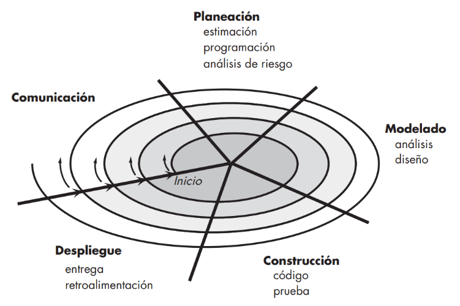
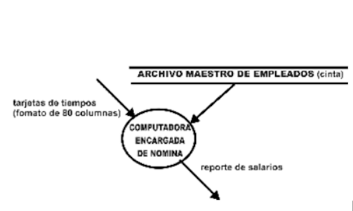
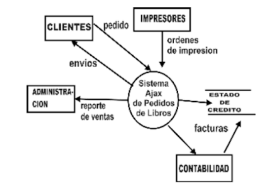
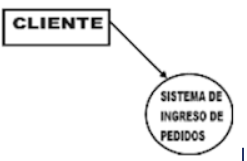
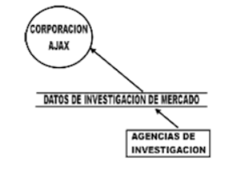
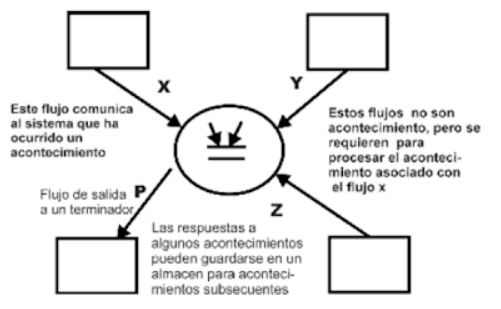

# MODULO II

## Metodología espiral

Propuesto en primer lugar por Barry Boehm, el modelo espiral es un modelo evolutivo del proceso del software y se acopla con la naturaleza iterativa de hacer prototipos con los aspectos controlados y sistémicos del modelo de cascada. Tiene el potencial para hacer un desarrollo rápido de versiones cada vez más completas.

Con el empleo del modelo espiral, el software se desarrolla en una serie de entregas evolutivas. Durante las primeras iteraciones, lo que se entrega puede ser un modelo o prototipo. En las iteraciones posteriores se producen versiones cada vez más completas del sistema cuya ingeniería se está haciendo.

Un modelo en espiral es dividido por el equipo de software en un conjunto de actividades estructurales. Para fines ilustrativos, se utilizan las actividades estructurales generales ya analizadas. Cada una de ellas representa un segmento de la trayectoria espiral ilustrada en la figura:

Al comenzar el proceso evolutivo, el equipo de software realiza actividades implícitas en un circuito alrededor de la espiral en el sentido horario, partiendo del centro. El riesgo se considera
conforme se desarrolla cada revolución. En cada paso evolutivo se marcan puntos
de referencia puntuales: combinación de productos del trabajo y condiciones que se encuentran
a lo largo de la trayectoria de la espiral
El primer circuito alrededor de la espiral da como resultado el desarrollo de una especificación del producto; las vueltas sucesivas se usan para desarrollar un prototipo y, luego, versiones
cada vez más sofisticadas del software. Cada paso por la región de planeación da como resultado ajustes en el plan del proyecto. El costo y la programación de actividades se ajustan con
base en la retroalimentación obtenida del cliente después de la entrega. Además, el gerente del
El proyecto ajusta el número planeado de iteraciones que se requieren para terminar el software.

A diferencia de otros modelos del proceso que finalizan cuando se entrega el software,
el modelo espiral puede adaptarse para aplicarse a lo largo de toda la vida del software de
cómputo. Entonces, el primer circuito alrededor de la espiral quizá represente un “proyecto
de desarrollo del concepto” que comienza en el centro de la espiral y continúa por iteraciones
múltiples hasta que queda terminado el desarrollo del concepto. Si el concepto va a desarrollarse en un producto real, el proceso sigue hacia fuera de la espiral y comienza un “proyecto de desarrollo de producto nuevo”. El nuevo producto evolucionará a través de cierto número de iteraciones alrededor de la espiral. Más adelante puede usarse un circuito alrededor de la espiral para que represente un “proyecto de mejora del producto”. En esencia, la espiral, cuando se caracteriza de este modo, sigue operativa hasta que el software se retira. Hay ocasiones en las que el proceso está inmóvil, pero siempre que se inicia un cambio comienza en el punto de entrada apropiado (por ejemplo, mejora del producto).

## Ciclos o iteraciones

En cada vuelta o iteración hay que tener en cuenta:

- Los objetivos: qué necesidad debe cubrir el producto.
- Alternativas: las diferentes formas de conseguir los objetivos de forma exitosa, desde diferentes puntos de vista como pueden ser:
  1. Características: experiencia del personal, requisitos a cumplir, etc.
  2. Formas de gestión del sistema.
  3. Riesgo asumido con cada alternativa.
- Desarrollar y Verificar: Programar y probar el software.
  Si el resultado no es el adecuado o se necesita implementar mejoras o funcionalidades:
- Se planificaron los siguientes pasos y se comienza un nuevo ciclo de la espiral. La espiral tiene una forma de caracola y se dice que mantiene dos dimensiones, la radial y la angular:
  1. Angular: Indica el avance del proyecto del software dentro de un ciclo.
  2. Radial: Indica el aumento del coste del proyecto, ya que con cada nueva iteración se pasa más tiempo desarrollando.

Este sistema es muy utilizado en proyectos grandes y complejos como puede ser, por ejemplo, la creación de un Sistema Operativo.

Al ser un modelo de Ciclo de Vida orientado a la gestión de riesgo se dice que uno de los aspectos fundamentales de su éxito radica en que el equipo que lo aplique tenga la necesaria experiencia y habilidad para detectar y catalogar correctamente los riesgos.

## Tareas

Para cada ciclo habrá cuatro actividades:

1. Determinar objetivos
2. Análisis del riesgo
3. Desarrollar y probar
4. Planificación

### Determinar o fijar objetivos

- Fijar también los productos definidos a obtener: requisitos, especificación, manual de usuario.
- Fijar las restricciones.
- Identificación de riesgos del proyecto y estrategias alternativas para evitarlos.
- Hay una cosa que solo se hace una vez: planificación inicial.

### Desarrollar, verificar y validar (probar)

- Tareas de la actividad propia y de prueba.
- Análisis de alternativas e identificación de resolución de riesgos.
- Dependiendo del resultado de la evaluación de los riesgos, se elige un modelo para el desarrollo, el que puede ser cualquiera de los otros existentes, como formal, evolutivo, cascada, etc. Así, por ejemplo, si los riesgos en la interfaz de usuario son dominantes, un modelo de desarrollo apropiado podría ser la construcción de prototipos evolutivos. Si los riesgos de protección son la principal consideración, un desarrollo basado en transformaciones formales podría ser el más apropiado.

### Análisis y evaluación del riesgo

- Se lleva a cabo el estudio de las causas de las posibles amenazas y probables eventos no deseados y los daños y consecuencias que éstas puedan producir. Se evalúan alternativas. Se debe tener un prototipo antes de comenzar a desarrollar y probar.

En resumen, es para tener en cuenta los riesgos de cada uno de los ámbitos.

## Ventajas

- El análisis del riesgo se hace de forma explícita y clara.
- Une los mejores elementos de los restantes modelos.
- Reduce riesgos del proyecto.
- Incorpora objetivos de calidad.

## Desventajas

- Genera mucho tiempo en el desarrollo del sistema
- Es un modelo costoso en recursos
- Requiere experiencia en la identificación de riesgos

## Inconvenientes

Planificar un proyecto con esta metodología es a menudo imposible, debido a la incertidumbre en el número de iteraciones que serán necesarias. En este contexto la evaluación de riesgos es de la mayor importancia y, para grandes proyectos, dicha evaluación requiere la intervención de profesionales de gran experiencia.
El IEEE clasifica al desarrollo en espiral como modelo no operativo en sus clasificaciones de MCV.​

## Análisis y diseño estructurado

El Análisis Estructurado (SA) en ingeniería de software y su técnica aliada, Diseño estructurado (SD), es un conjunto de métodos orientados a analizar y convertir requisitos de negocio en especificaciones y en última instancia, programas informáticos, configuraciones de hardware y procedimientos manuales relacionados.

Las técnicas de análisis y diseño estructurado son herramientas fundamentales de análisis de sistemas desarrolladas a partir de análisis de sistemas clásicos de los años 1960 y 1970.

## El modelo esencial

El modelo esencial del sistema es un modelo de lo que el sistema debe hacer para satisfacer los requerimientos del usuario, diciendo lo mínimo posible acerca de cómo se implanta.

Cuando el analista habla con el usuario acerca de los requerimientos del sistema, debe evitar describir implantaciones específicas de procesos (burbujas en un diagrama de flujo de datos) en el sistema.

No debe mostrar las funciones del sistema que están siendo realizadas por humanos o por sistemas de cómputo existentes

Modelo que muestra cómo hará su labor una función

El modelo esencial consiste en dos componente principales:

- modelo ambiental
- modelo de comportamiento

## El modelo ambiental

Para el analista de sistemas, la labor más difícil en la especificación de un sistema es a menudo determinar qué es parte del sistema y qué no.

El primer modelo importante que se debe desarrollar como analista es uno que no haga más que definir las interfaces entre el sistema y el resto del universo, es decir, el ambiente.

Por razones obvias, este modelo se conoce como el modelo ambiental. Por lo tanto, se necesita saber qué información entra al sistema desde el ambiente exterior, y qué información produce como salida al ambiente externo.

Otro aspecto crítico del modelo ambiental consiste en identificar los acontecimientos que ocurren en el ambiente al cual debe responder el sistema. No para todos los acontecimientos;
El ambiente en su totalidad genera un número infinito de acontecimientos.
Sólo nos preocupan aquellos que ocurren en el ambiente exterior y requieren una respuesta del sistema.

En un sistema grande se puede tomar en cuenta una cantidad de factores cuando se están escogiendo las perspectivas del proyecto. Los más importantes:

- El deseo del usuario de lograr cierta participación en el mercado para el producto, o incrementarla a más de su nivel actual. Esto se puede hacer ofreciendo un nuevo producto o una mayor funcionalidad de uno existente.

- La legislación establecida por el gobierno, o de la ciudad. Por ejemplo tendría que hacerse un nuevo sistema para considerar los cambios en las leyes sobre impuestos.

- Deseo del usuario por minimizar gastos operativos de alguna área de su negocio. La mayor parte de las organizaciones que tienen ordenadores desde hace tiempo aprovecharon las oportunidades obvias de reducir el personal de oficina.

- Deseo del usuario para lograr alguna ventaja estratégica para la línea de productos o áreas de negocios que opera.

- Un buen ejemplo de esto son las líneas aéreas donde la mejor información acerca de tendencias del mercado y preferencias de los clientes pueden llevar a costos de pasajes e itinerarios de aerolíneas más eficientes.

### El modelo ambiental consta de tres componentes:

1.  Declaración de propósitos.

    Es la declaración textual breve y concisa del propósito del sistema, dirigida al nivel administrativo superior, la administración de los usuarios, y otros que no están directamente involucrados con el desarrollo del sistema.

    Ejemplo de la declaración de propósito típica:
    El propósito del Sistema de Procesamiento de Libros Ajax es manejar todos los detalles de los pedidos de los libros de los clientes, además del envío, facturación y cobro retroactivo a clientes con facturas vencidas.
    La información acerca de los pedidos de los libros debe estar disponible para otros sistemas, tales como mercadeo, ventas y contabilidad

2.  Lista de acontecimientos

    Es una lista narrativa de los estímulos que ocurren en el mundo exterior a los cuales el sistema debe responder.

    A continuación se muestra una lista de acontecimientos para el sistema de pedidos de libros.

    1. Un cliente hace un pedido (F).
    2. Un cliente cancela un pedido (F).
    3. La administración pide un reporte de ventas (T).
    4. Llega un pedido de reimpresión de un libro al almacén (C).

#### F,T,C - flujo, temporal, o de control

El orientado a flujos es el que se asocia con un flujo de datos; es decir, el sistema se da cuenta de que ha ocurrido el acontecimiento cuando llega algún dato (o posiblemente varios).
Los acontecimientos temporales arrancan con la llegada de un momento dado en el tiempo.

Ejemplos de acontecimientos temporales :

- A las 9:00 de la mañana se requiere un informe diario de todos los pedidos de libros.
- Las facturas deben generarse a las 3:00 PM.
- Se deben generar reportes administrativos una vez por hora

Los acontecimientos de control deben considerarse un caso especial del acontecimiento temporal: un estímulo externo que ocurre en algún momento impredecible.

A diferencia de un acontecimiento temporal normal, el acontecimiento de control no se asocia con el paso regular del tiempo, por lo que el sistema no puede anticiparlo utilizando un reloj interno

Construcción de la lista de acontecimiento

La lista de acontecimientos es un listado textual sencillo de los acontecimientos del ambiente a los cuales debe responder el sistema. Al crear la lista de acontecimiento se debe asegurar de distinguir entre un acontecimiento y un flujo relacionado con un acontecimiento.

Por ejemplo, lo siguiente probablemente no sea un acontecimiento:

            "El sistema recibe el pedido del cliente"

Más bien, es el flujo de datos de entrada mediante el cual el sistema se da cuenta de que ha ocurrido el acontecimiento. Un nombre más apropiado para el acontecimiento sería:

            "El cliente hace un pedido"

La manera más fácil de identificar los acontecimientos para un sistema es visualizarlo en acción: examinar cada terminador y preguntar qué efecto pueden tener sus acciones sobre el sistema.

La lista de acontecimientos debe incluir no sólo las interacciones normales entre el sistema y sus terminadores sino también situaciones de fallos.

Por ejemplo, nuestra lista de acontecimientos para el Sistema de Pedido de Libros Ajax incluía un acontecimiento llamado "el pedido de impresión de libro llega al almacén". (véase Diagrama de contexto)

Pero ¿Qué tal si no llega a tiempo (por ejemplo, una semana después de la fecha prometida por el impresor)? ¿Qué debería hacer el sistema?, Por lo que se necesitaría un acontecimiento adicional iniciado por el sistema para hacer que se comunique con el impresor y localice el origen del retraso.

## Diagrama de contexto.
Es un caso especial de diagrama de flujo de datos, en donde una sola burbuja representa todo el sistema.
La figura muestra un diagrama de contexto de un sistema de pedidos de libros.
    

###Características importantes:
1. Las personas, organizaciones y sistemas con los que se comunica el sistema. Se conocen como terminadores.
2. Los datos que el sistema recibe del mundo exterior y que deben procesarse de alguna forma.
3. Los datos que el sistema produce y que se envían al mundo exterior.
4. Los almacenes de datos que el sistema comparte con los terminadores. Estos almacenes de datos se crean fuera del sistema para su uso, o bien son creados en él y usados fuera.
5. La frontera entre el sistema y el resto del mundo.

El diagrama de contexto consiste en terminadores, flujos de datos y flujos de control, almacenes de datos y un solo proceso que representa a todo el sistema.

La parte más fácil del diagrama de contexto es el proceso; como hemos visto, consiste en una sola burbuja.
El nombre dentro del proceso suele ser el nombre del sistema completo o un acrónimo convenido.
Ejemplo: Nombre típico de proceso para un diagrama de contexto

Los terminadores se representan con rectángulos en el diagrama de contexto. Se comunican directamente con el sistema a través de flujos de datos o de control.

Comunicación directa entre terminado y sistema

Comunicación a través de un almacén externo

Punto en consideración de los terminadores:

1. Algunos terminadores tienen un buen número de entradas y salidas. Para evitar un diagrama innecesariamente atiborrado conviene dibujar el terminador más de una vez.
2. Los terminadores duplicados se marcan con un asterisco.
3. Cuando el terminador es una persona individual, generalmente es preferible indicar el rol que desempeña, más que su identidad.
4. Dado que estamos interesados en desarrollar un modelo esencial del sistema, es importante distinguir entre fuente y manejadores.

### Almacenes de datos

Un manejador es un mecanismo, dispositivo, medio físico usado para transportar datos hacia o fuera del sistema. Dado que a menudo, dichos manejadores son familiares y visibles para los usuarios de la implantación actual de un sistema, existe la tendencia a mostrar al manejador, en lugar de la verdadera fuente de los datos

### Flujos

- Flujos de control.-
    Los flujos que aparecen en el diagrama de contexto modelan datos que entran y salen del sistema, además de las señales de control que recibe o genera.
- Los flujos de datos se incluyen en el diagrama de contexto si se ocupan para detectar un acontecimiento en el ambiente al que deba responder el sistema, o si se ocupan (como datos) para producir una respuesta.

## El modelo de comportamiento

Dentro del modelo de comportamiento se involucró el desarrollo de un diagrama de flujo de datos y un diagrama de entidad-relación preliminares, además de la elaboración de las entradas iniciales del diccionario.

Para explicar el modelo de comportamiento utilizaremos el enfoque de partición por acontecimiento, el cual incluye los siguientes cuatro pasos:

1. Se dibuja una burbuja, o proceso, para cada acontecimiento de la lista.
2. La burbuja se nombra describiendo la respuesta que el sistema debe dar al acontecimiento asociado.
3. Se dibujan las entradas y salidas apropiadas de tal forma que la burbuja pueda dar la respuesta requerida, y se dibujan los almacenes, como sea apropiado, para la comunicación entre burbujas.
4. El borrador de DFD que resulta se compara con el diagrama de contexto y la lista de acontecimientos para asegurar que está completo y sea consistente

El primer paso es directo y mecánico: si existen 25 acontecimientos en la lista, se deben dibujar 25 burbujas.

El segundo paso también es directo y mecánico: a cada burbuja se le da un nombre apropiado, basado en la respuesta requerida.

¿Esto significa que se debe examinar el acontecimiento y preguntar qué respuesta debe dar el sistema a este Acontecimiento?.

El tercer paso definitivamente no es mecánico, pero usualmente es bastante directo. Para cada burbuja dibujada, identifique las entradas que requiere para efectuar su trabajo.

Identifique las salidas que cada una produce e identifique los almacenes a los que cada burbuja debe tener acceso

Esto normalmente se hace entrevistando al usuario o usuarios apropiados y concentrándose en cada acontecimiento y su burbuja asociada.

Las preguntas son: ¿Qué necesita esta burbuja para hacer su trabajo? y ¿Qué salidas genera?.

En muchos casos el acontecimiento está determinado por el flujo.

El sistema detecta la ocurrencia de un acontecimiento por la llegada de algún dato de un terminador externo, esto es, se pueden requerir entradas adicionales (de otros terminadores, y de almacenes de datos) para que un proceso produzca su salida requerida.

De manera similar, como parte de la respuesta dibuje las salidas adecuadas
producidas por el proceso.

En muchos casos, esto implicara devolver salidas a los terminadores fuera del sistema; sin embargo, puede también involucrar salidas que se envían a los almacenes de datos, para ser usadas como entradas de otros procesos.

### Entradas y salidas de un proceso

El cuarto paso es una actividad de verificación de consistencia.

Verifique cada entrada del diagrama de contexto para ver si está conectada con alguna entrada de alguno de los procesos del DFD preliminar, y verifique también que cada salida producida por algún proceso en el DFD preliminar se envíe a un almacén o sea una salida externa incluida en el diagrama de contexto.

Existen dos casos especiales:

1. acontecimientos únicos que causan respuestas múltiples y
2. acontecimientos múltiples que causan la misma respuesta.

En el primer caso, un solo acontecimiento puede causar múltiples respuestas, cada una de las cuales se modela con su propia burbuja en el DFD preliminar.

Sólo es apropiado si todas las respuestas usan el mismo flujo de datos de entrada, y sólo si todas las respuestas son independientes entre sí.

De manera inversa, habrá situaciones ocasionales en las que un proceso se asocia con más de un acontecimiento.

Es válido y apropiado sólo si la respuesta de la burbuja es idéntica para los diversos acontecimientos, y sólo si los datos de entrada y salida son idénticos para las diversas respuestas a acontecimientos.

Obsérvese que en los ejemplos anteriores ninguno de los procesos en el diagrama de flujo de datos preliminar está conectado con otro; las burbujas no se comunican directamente con otras. En vez de eso se comunican entre sí a través de otros almacenes de datos.

Una vez hecho esto se procede a un proceso de limpieza, el cual se describe posteriormente, para producir un modelo bien organizado del proceso y un modelo de datos para presentarlo al usuario final. Este enfoque se llamó partición por acontecimientos.
